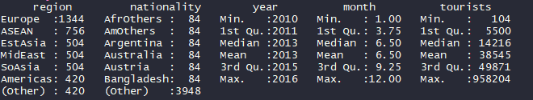
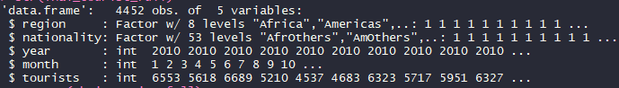
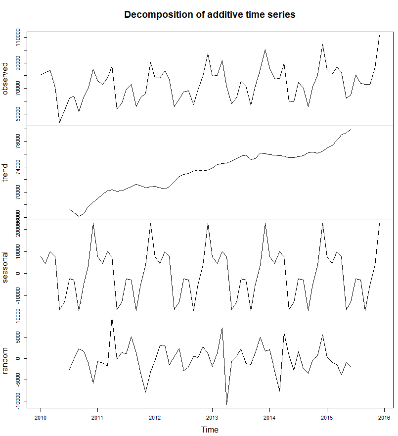

# Time Series Analysis on a Tourism dataset

The project consists of showing how to implement Time series analysis on a Tourism dataset.

# Getting Started

- Download [https://code.visualstudio.com/] or another alternative source-code editor of your preference
- Download the project on [https://github.com/taxenco/Time_Series_Analysis_R].
- Go to your terminal and run the following command --> git clone https://github.com/taxenco/Time_Series_Analysis_R
- Access to Visual Studio Code or another alternative source-code editor and open the project. Alternatively, you can access the project on through the terminal.
- Download R support for Visual Studio Code

# Prerequisites

- Visual Studio Code or another alternative source-code editor.
- Linux.
- R support for Visual Studio Code.
- CSV files.
- Forecast Package

# The objective of the project

This project will implement Time series analysis on a Tourism dataset to understand the underlying trends, and it will try to forecast the future.

# Theory on Time Series Analysis

Time series analysis is a statistical technique that deals with time series data, or trend analysis. Time series data means that data is in a series of particular time periods or intervals.

Time Series Analysis is used for many applications such as:

- Economic Forecasting
- Sales Forecasting
- Budgetary Analysis
- Stock Market Analysis
- Yield Projections
- Process and Quality Control
- Inventory Studies
- Workload Projections
- Utility Studies
- Census Analysis

Techniques: The fitting of time series models can be an ambitious undertaking. There are many methods of model fitting including the following:

· Box-Jenkins ARIMA models

· Box-Jenkins Multivariate Models

· Holt-Winters Exponential Smoothing (single, double, triple)

# Data

The data selected is a Thailand Tourism dataset. The data used was found on:

· https://data.world/payapdatasci/thai-tourism

The dataset is made 5 decision variables.

· Region

· Nationality

· Year

· Month

· Tourists

# Data cleaning

The dataset is already cleaned, and it is ready for performing the decision tree.

# Calculating Time Series Analysis

This section will show how to calculate Time Series Analysis.

Let ‘s start inspecting the dataset:

Five-number summary

We filter data that only contains UK tourist’s data and we will split it in 2 parts. The first part will be the training dataset that will contain the years 2010,2011,2012,2013,2014 and 2015. The validation dataset will just contain 2016. After this will convert the both datasets in time series objects.

Seasonality

Accuracy measures for a forecast model

- ME: Mean Error
- RMSE: Root Mean Squared Error
- MAE: Mean Absolute Error
- MPE: Mean Percentage Error
- MAPE: Mean Absolute Percentage Error
- MASE: Mean Absolute Scaled Error
- ACF1: Autocorrelation of errors at lag 1.

* methods-Mean forecasting:
  
  

* methods-Time series linear model
  
  

* methods-Time series linear model with seasonality
  
  

* methods-Holt-Winters' Seasonal method
  
  

There are different error measures for the fit of each time-series forecast the model. Which one to choose is up to the user. A common approach is to use the RMSE, which a classic method and very popular. In this case, the best mode would be Time-series linear model with seasonality.

# Conclusion

Time Series Analysis is an excellent method to analyse and predict trends. In additions is very simple to implement and to understand the results.
The implementation of the Time Series Analysis has achieved its purpose of illustrating the process of analysing the trends and forecasting.

# References

- 1 - https://www.statisticssolutions.com/time-series-analysis/
- 2 - MSc Data science notes, Salford University. Time Series
- 3- https://pkg.robjhyndman.com/forecast/reference/accuracy.html

# Built With

- Linux - Operating system
- R programming language
- CSV files
- Forecast Package

# Authors

Carlos Beltran.

# Acknowledgements

The author would like to thank Salford University.
